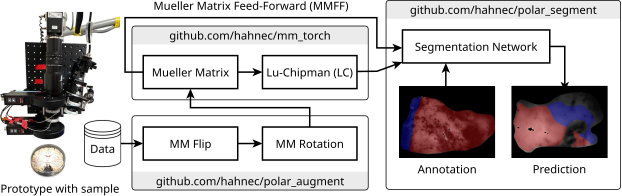

# polar_segment

This is a polarimetric image segmentation framework developed for brain tumor identification. This framework uses the `HORAO NPP dataset` (formerly `TumorMeasurementsCalib`; see dataloader in git history) containing per-pixel Mueller matrices of ex-vivo brain tissues. Nonetheless, swapping the dataset loading file `horao_dataset.py` with a custom dataset should be possible as long as the labels of the custom dataset are arranged accordingly.

## Schematic Overview

<p align="center" style="background-color: white;">
  
</p>

## Citation

### Optics Express

<pre>@article{hahne:2025:polar_segment,
  author={},
  journal={}, 
  title={}, 
  year={},
  volume={},
  number={},
  pages={},
  keywords={},
  doi={}
}</pre>

### IEEE Trans. on Image Processing

<pre>@misc{hahne:2024:polar_augment,
      title={Physically Consistent Image Augmentation for Deep Learning in Mueller Matrix Polarimetry}, 
      author={Christopher Hahne and Omar Rodriguez-Nunez and Éléa Gros and Théotim Lucas and Ekkehard Hewer and Tatiana Novikova and Theoni Maragkou and Philippe Schucht and Richard McKinley},
      year={2024},
      eprint={2411.07918},
      archivePrefix={arXiv},
      primaryClass={cs.CV},
      url={https://arxiv.org/abs/2411.07918}, 
} </pre>

## Installation

### Dependencies

This repo uses the following related polarimetry frameworks:

- [mm_torch](https://github.com/hahnec/mm_torch) for deterministic Mueller matrix processing
- [polar_augment](https://github.com/hahnec/polar_augment) for data augmentation tailored for polarimetry

They can be installed automatically by:

```bash
$ git clone github.com/hahnec/polar_segment
$ cd polar_segment
$ bash install.sh
```
### Models

1. Download a set of *k-fold* models and [cite our work in IEEE Trans. on Image Proc.](#ieee-trans-on-image-processing):

  - [trim-wood-227_ckpt_epoch184.pt (k=1)](https://github.com/hahnec/polar_segment/raw/refs/heads/feat_600nm/ckpts/tip/trim-wood-227_ckpt_epoch184.pt)
  - [atomic-sunset-231_ckpt_epoch118.pt (k=2)](https://github.com/hahnec/polar_segment/raw/refs/heads/feat_600nm/ckpts/tip/atomic-sunset-231_ckpt_epoch118.pt) 
  - [vocal-frost-235_ckpt_epoch113.pt (k=3)](https://github.com/hahnec/polar_segment/raw/refs/heads/feat_600nm/ckpts/tip/vocal-frost-235_ckpt_epoch113.pt)
  
2. After successful download, place the models under the `polar_segment/ckpts/` directory.

3. Adjust the configuration by changing the `model_file` variable in `polar_segment/configs/infer.yml` for inference or `polar_segment/configs/train_local.yml` for training.

Optional: This repo provides the possibility to feed decomposed Lu-Chipman features as inputs to the segmentation network. Note that this option takes significantly more processing time (see [here](#optics-express)). To enable the Lu-Chipman decomposition, open `polar_segment/configs/infer.yml` and set the `levels` variable to 1 while adapting the `model_file` (see point 3 above).

### Data

The release of the herein used dataset is yet to come. Please send a request to `elearomy.gros@unibe.ch` or `theoni.maragkou@unibe.ch` and ask for permission to download and use this dataset.

## Run

Before running, make sure the previously installed environment is activated via `$ source venv/bin/activate`.

### Inference
```bash
$ python3 infer.py
```

### Training
```bash
$ python3 train.py
```

## Acknowledgment

This work was supported by the Swiss National Science Foundation (SNSF) Sinergia Grant No. CRSII5\_205904, "HORAO - Polarimetric visualization of brain fiber tracts for tumor delineation in neurosurgery." We thank the Translational Research Unit, Institute of Tissue Medicine and Pathology, University of Bern, for their assistance with histology and acknowledge UBELIX, the HPC cluster at the University of Bern (https://www.id.unibe.ch/hpc), for computational resources.
